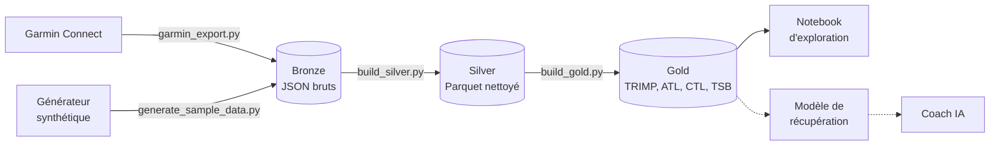

# Garmin-Run — charge d'entraînement et récupération multisport

[](https://github.com/Edouardmnt/Garmin-Run/actions/workflows/ci.yml)

Projet personnel de data engineering et d'IA, construit **de bout en bout** à partir de mes propres données de montre Garmin : ingestion, data lake en couches, indicateurs d'entraînement, exploration, puis (à venir) modèle de récupération, conteneurisation, CI/CD, déploiement Kubernetes et coach IA.

**La question de départ :** ma charge d'entraînement (course, tennis, musculation) a-t-elle un effet mesurable sur ma récupération, et peut-on la prédire ?

---

## Architecture



Le pipeline suit l'**architecture en médaillon** :

| Couche | Contenu | Script |
|---|---|---|
| **Bronze** | Réponses brutes de Garmin Connect, jamais modifiées | `ingestion/garmin_export.py` |
| **Silver** | Deux tables Parquet propres : une ligne par activité, une ligne par jour | `processing/build_silver.py` |
| **Gold** | Indicateurs métier prêts pour l'analyse et le ML | `processing/build_gold.py` |

---

## Démarrage rapide (sans compte Garmin)

Le dépôt ne contient **aucune donnée**. Un générateur produit des données **synthétiques** au même format que l'export Garmin réel, pour lancer tout le pipeline en quelques secondes.

Prérequis : Python 3.12 ou plus récent (ou Docker, voir plus bas).

**Linux / macOS**

```bash
python -m venv .venv && source .venv/bin/activate
pip install -r requirements.txt

python scripts/generate_sample_data.py
export RUNLAB_DATA_DIR=data/sample
python processing/build_silver.py
python processing/build_gold.py
```

**Windows (PowerShell)**

```powershell
python -m venv .venv
.venv\Scripts\Activate.ps1
pip install -r requirements.txt

python scripts\generate_sample_data.py
$env:RUNLAB_DATA_DIR = "data/sample"
python processing\build_silver.py
python processing\build_gold.py
```

La variable `RUNLAB_DATA_DIR` indique au pipeline d'utiliser `data/sample/` au lieu de `data/`. Sans elle, les scripts lisent les vraies données.

## Avec Docker

L'image contient tout le pipeline. Elle est construite, testée et publiée automatiquement sur le GitHub Container Registry à chaque push sur `main`.

```bash
docker run --rm ghcr.io/edouardmnt/garmin-run:latest demo
```

Ou en la construisant localement :

```bash
docker build -t garmin-run .
docker run --rm garmin-run demo                          # données synthétiques
docker run --rm -v "$(pwd)/data:/data" garmin-run process  # vos données brutes -> silver -> gold
```

| Mode | Étapes |
|---|---|
| `demo` | données synthétiques → silver → gold |
| `sync` | export Garmin Connect → silver → gold |
| `process` | silver → gold à partir des données brutes existantes |
| `train` | entraînement et évaluation du modèle de récupération |
| `transfer` | expérience de transfert avec LifeSnaps (si le fichier est présent dans le volume) |

Le mode `sync` lit sa configuration dans des variables d'environnement (`GARMIN_DAYS`, `GARMINTOKENS`, `GARMIN_EMAIL`, `GARMIN_PASSWORD`) : aucun identifiant n'est inclus dans l'image. La synchronisation est **incrémentale** : elle repart du dernier jour déjà téléchargé (*watermark*) et récupère tous les jours manquants, que la dernière exécution date d'hier ou de plusieurs semaines. Les activités sont fusionnées avec l'historique, sans doublon.

## Sur Kubernetes

Le dossier `k8s/` déploie la synchronisation quotidienne sur un cluster (testé avec minikube) :

| Ressource | Rôle |
|---|---|
| `Namespace` `garmin-run` | Isole toutes les ressources du projet |
| `PersistentVolumeClaim` `garmin-data` | Volume persistant pour `/data` (bronze, silver, gold, jetons) |
| `ConfigMap` `garmin-config` | Configuration non sensible (profondeur du chargement initial, chemins) |
| `Secret` `garmin-credentials` | Identifiants de secours, optionnel, jamais versionné |
| `CronJob` `garmin-sync` | Pipeline `sync` chaque matin à 6 h (Europe/Paris), sans chevauchement, une seule nouvelle tentative, rattrapage jusqu'à 7 jours |

```bash
kubectl apply -f k8s/
kubectl -n garmin-run create job sync-test --from=cronjob/garmin-sync   # lancement manuel
kubectl -n garmin-run logs -f job/sync-test
```

Le conteneur tourne avec un utilisateur sans privilèges, avec des ressources limitées. Les manifestes sont validés en CI avec kubeconform.

## API : forme du jour, temps prédits, allures

Une API FastAPI expose les résultats du pipeline. C'est elle que le futur coach IA interrogera pour construire une préparation.

```bash
uvicorn api.main:app --reload     # documentation interactive : http://127.0.0.1:8000/docs
```

| Point d'accès | Réponse |
|---|---|
| `GET /forme` | VFC et sommeil par rapport à la normale personnelle, charge aiguë et chronique, fraîcheur, ajustement du chrono du jour |
| `GET /predictions?distance=10k&denivele_m=150` | Temps sur 5 km, 10 km, semi et marathon : sur le plat, sur le parcours visé (D+), et ajusté à la forme du jour ; prédiction de la montre pour comparaison |
| `GET /allures` | Allures d'entraînement personnelles (EF, tempo, fractionné) : observées dans les séances étiquetées, modèle FC → allure, et théorie VDOT pour comparaison ; allure max (meilleur km) |
| `GET /seances` | Dernières sorties avec leur type (étiquette personnelle, sinon suggestion par règles) |

**Méthode de prédiction** (`processing/performance.py`) : les formules de **Daniels et Gilbert (VDOT)** transforment une performance réelle en indicateur de capacité aérobie, puis en temps sur chaque distance et en allures d'entraînement. Les tests vérifient la conformité aux tables publiées de Daniels. Les performances utilisées sont les courses étiquetées et les meilleurs temps sur 1, 5 et 10 km calculés par Garmin dans chaque sortie, sur les 90 derniers jours.

**Dénivelé** : toutes les sorties sont ramenées à une vitesse équivalente sur le plat, avec l'allure ajustée à la pente calculée par Garmin quand elle existe, sinon l'**équivalence de Scarf** (1 m de montée coûte autant que 7,92 m de plat ; Scarf, *Journal of Sports Sciences*, 2007). Une course ou un footing vallonné n'est donc plus pénalisé, et le temps d'un parcours vallonné se prédit à partir de sa distance de plat équivalente.

**Ajustement du jour** : une VFC nettement sous la normale, une nuit courte ou une fatigue accumulée allongent le temps prédit ; une fraîcheur positive le raccourcit légèrement. L'ajustement est volontairement prudent, borné entre -1 % et +3 %, et chaque correction est expliquée dans la réponse. Il sera calibré sur les données personnelles à mesure qu'elles s'accumulent.

Sur Kubernetes, l'API tourne dans un `Deployment` avec sondes de disponibilité et de vivacité, et lit le volume de données en lecture seule (`k8s/40-api.yaml`) :

```bash
kubectl -n garmin-run port-forward svc/garmin-api 8000:80
```

## Avec ses propres données Garmin

```bash
pip install -r requirements-dev.txt    # environnement complet : pipeline, Jupyter, tests
python ingestion/garmin_export.py      # identifiants demandés au premier lancement
python processing/build_silver.py
python processing/build_gold.py
jupyter notebook notebooks/01_exploration.ipynb
```

L'export utilise la bibliothèque non officielle [python-garminconnect](https://github.com/cyberjunky/python-garminconnect). Elle peut cesser de fonctionner quand Garmin modifie son système de connexion, et Garmin peut limiter temporairement les connexions trop fréquentes (erreur 429). À utiliser uniquement sur son propre compte, avec une synchronisation quotidienne au maximum.

---

## Tests et intégration continue

```bash
pip install -r requirements-test.txt
ruff check .     # qualité du code
pytest -v        # tests unitaires et test de bout en bout du pipeline
```

À chaque push sur `main`, GitHub Actions (`.github/workflows/ci.yml`) vérifie le code avec ruff, génère les données synthétiques et exécute tout le pipeline bronze → silver → gold. Les tests vérifient notamment que les sports sont harmonisés, qu'une nuit sans montre reste absente (et non à zéro) et que la cible du modèle correspond bien à la nuit suivante.

---

## Indicateurs calculés

**TRIMP de Banister** (*TRaining IMPulse*) : la charge d'une séance, calculée à partir de sa durée et de la fréquence cardiaque moyenne. Il rend comparables des sports très différents (une heure de tennis et quarante minutes de course).

```
réserve = (FC moyenne − FC repos) / (FC max − FC repos)
TRIMP   = durée (min) × réserve × 0,64 × e^(1,92 × réserve)
```

Les FC de repos et maximale sont estimées à partir des données de l'utilisateur.

| Indicateur | Signification | Calcul |
|---|---|---|
| **ATL** | Charge aiguë : fatigue récente | Moyenne exponentielle de la charge sur ~7 jours |
| **CTL** | Charge chronique : forme de fond | Moyenne exponentielle sur ~42 jours |
| **TSB** | Fraîcheur | CTL − ATL (négatif = plus fatigué que d'habitude) |
| **ACWR** | Ratio charge aiguë / chronique | ATL / CTL |

Choix méthodologiques :

- **Une nuit sans montre n'est pas une nuit à zéro.** Les nuits non suivies sont marquées (`night_tracked`) et exclues de l'analyse, au lieu d'être remplacées par 0.
- **La récupération est mesurée par rapport à sa propre référence** : on étudie l'écart de VFC à sa moyenne glissante sur 7 jours, pour neutraliser l'état de départ (on s'entraîne davantage les jours où l'on est déjà en forme).

---

## Modèle de récupération

**Objectif :** prédire la VFC (variabilité de la fréquence cardiaque) de la nuit suivante à partir de l'état de récupération du jour, de la charge d'entraînement et du contexte (jour de repos, heure de la dernière séance, week-end).

```bash
python -m ml.train_recovery
mlflow ui --backend-store-uri sqlite:///data/mlflow/mlflow.db   # puis http://127.0.0.1:5000
```

Méthode :

- **Validation temporelle (walk-forward)** : le modèle est toujours entraîné sur le passé et testé sur le futur, sur 5 périodes successives. Un découpage aléatoire ferait « voir l'avenir » au modèle et surestimerait ses performances.
- **Deux références naïves** : « la VFC de demain sera celle d'aujourd'hui » et « la VFC de demain sera ma moyenne des 7 derniers jours ». Un modèle n'est retenu comme utile que s'il fait mieux que la meilleure des deux.
- **Quatre modèles** : une régression Ridge (simple et interprétable) et un gradient boosting (effets non linéaires, valeurs manquantes gérées nativement), chacun en deux versions : prédiction directe de la VFC, ou version **résiduelle** qui n'apprend que la correction à apporter à la moyenne des 7 derniers jours. Sans signal, la version résiduelle retombe sur la référence.
- **Données exclues** : les nuits non suivies et les nuits de moins de 4 h, probablement enregistrées en partie seulement.
- **Suivi avec MLflow** : paramètres, erreurs moyennes (MAE) de chaque modèle et de chaque référence, gain par rapport à la meilleure référence, et modèle final. Le suivi est stocké dans `data/`, donc jamais publié.

## Transfert : apprendre aussi des autres

Mes données ne couvrent que quelques mois. Pour savoir si les données d'autres personnes peuvent aider à prédire **ma** récupération, le projet intègre le jeu public **LifeSnaps** : 71 participants suivis plusieurs mois avec une montre Fitbit Sense, dont 43 avec une VFC nocturne et environ 2 100 paires de nuits consécutives exploitables.

```bash
python scripts/profile_lifesnaps.py   # vérifie le jeu avant de l'utiliser
python -m ml.train_transfer           # expérience de transfert, suivie dans MLflow
```

**Harmonisation entre deux montres** (`ml/features.py`) :

- toutes les variables sont **relatives à la personne** : VFC en écart relatif à sa moyenne, FC de repos et sommeil en écart à sa référence sur 28 jours, charge rapportée à sa charge chronique (ACWR) ;
- la charge LifeSnaps est un **TRIMP d'Edwards** calculé à partir des minutes passées dans chaque zone cardiaque ;
- la cible est la **variation relative** de la VFC du lendemain, comparable d'une montre et d'une personne à l'autre ;
- les références personnelles sont calculées **uniquement sur le passé**, ce que vérifie un test dédié ;
- le score de stress est exclu : Fitbit et Garmin l'expriment dans des sens opposés.

**Trois stratégies**, toutes évaluées sur mes données avec la même validation temporelle :

| Stratégie | Entraînement |
|---|---|
| `personnel` | mon historique passé uniquement |
| `global` | les participants LifeSnaps uniquement |
| `global_plus_personnel` | LifeSnaps et mon historique passé, mes jours ayant un poids 5 fois plus fort |

> Données : Yfantidou S. et al. (2022). *LifeSnaps, a 4-month multi-modal dataset capturing unobtrusive snapshots of our lives in the wild.* Scientific Data. Jeu de données : [doi:10.5281/zenodo.7229547](https://doi.org/10.5281/zenodo.7229547), licence CC BY 4.0. Les données ne sont pas incluses dans ce dépôt.

## Premiers résultats

Analyse sur environ 5 mois de données réelles (≈ 145 nuits suivies), détaillée dans `notebooks/01_exploration.ipynb` :

- Le **tennis** représente la plus grande part de la charge, devant la course : un suivi limité à la course sous-estimerait fortement la charge réelle.
- **Aucun effet significatif** de la charge du jour sur la VFC des nuits suivantes. La charge **accumulée** (ATL) montre une tendance négative cohérente de J+2 à J+5, dans le sens attendu, mais encore dans le bruit statistique.
- Contrairement à l'hypothèse de départ, les **séances du soir** ne dégradent pas la nuit suivante. Ce résultat repose sur de petits groupes et pourrait être influencé par le jour de la semaine.

## Limites connues

- Le TRIMP, fondé sur la fréquence cardiaque, **sous-estime la musculation**, où l'effort est réel mais le cœur monte peu.
- La FC maximale utilisée est la plus haute **observée**, pas forcément la vraie FC maximale.
- Quelques mois de données personnelles : les conclusions sont exploratoires et seront réévaluées à mesure que les données s'accumulent.

---

## Confidentialité

Les données de santé et de localisation ne quittent jamais la machine locale :

- `data/` est entièrement ignoré par Git (`.gitignore`) ;
- les jetons Garmin sont stockés hors du dépôt (`~/.garminconnect`) ;
- les sorties des notebooks (graphiques, tableaux) sont effacées automatiquement à chaque commit grâce à [nbstripout](https://github.com/kynan/nbstripout) ;
- seuls des résultats agrégés sont publiés.

---

## Structure du dépôt

```
├── ingestion/
│   └── garmin_export.py         # export Garmin Connect -> data/raw (bronze)
├── processing/
│   ├── build_silver.py          # bronze -> silver (Parquet)
│   ├── build_gold.py            # silver -> gold (TRIMP, ATL, CTL, TSB)
│   └── performance.py           # VDOT, temps prédits, allures, ajustement du jour
├── scripts/
│   ├── generate_sample_data.py  # données Garmin synthétiques pour la démo
│   ├── generate_sample_lifesnaps.py # données LifeSnaps synthétiques pour les tests
│   ├── profile_lifesnaps.py     # profilage du jeu public avant intégration
│   ├── make_run_labels.py       # fichier d'étiquetage des sorties, avec suggestions par règles
│   ├── label_runs.py            # étiquetage interactif dans le terminal
│   └── run_pipeline.py          # point d'entrée (modes demo, sync, process)
├── ml/
│   ├── features.py              # harmonisation Garmin / LifeSnaps, variables relatives sans fuite
│   ├── models.py                # modèle résiduel (correction de la moyenne des 7 jours)
│   ├── tracking.py              # configuration commune de MLflow
│   ├── train_recovery.py        # modèle personnel, évaluation temporelle et suivi MLflow
│   └── train_transfer.py        # expérience personnel / global / global + personnel
├── notebooks/
│   └── 01_exploration.ipynb     # analyse exploratoire et conclusions
├── api/
│   └── main.py                  # API FastAPI (forme, prédictions, allures, séances)
├── k8s/                         # manifestes Kubernetes (namespace, volume, config, CronJob, API)
│   └── tools/data-loader.yaml   # pod utilitaire pour accéder au volume
├── tests/                       # tests unitaires et de bout en bout (pytest)
├── .github/workflows/ci.yml     # intégration continue
├── Dockerfile                   # image du pipeline
├── .dockerignore
├── pyproject.toml               # configuration pytest et ruff
├── requirements.txt             # dépendances du pipeline (image Docker)
├── requirements-test.txt        # dépendances de la CI
├── requirements-dev.txt         # environnement de développement complet
├── .gitignore
└── .gitattributes
```

---

## Feuille de route

- [x] Ingestion Garmin Connect (bronze)
- [x] Nettoyage et structuration en Parquet (silver)
- [x] Indicateurs d'entraînement : TRIMP, ATL, CTL, TSB (gold)
- [x] Analyse exploratoire
- [x] Données synthétiques de démonstration
- [x] Tests automatisés et CI avec GitHub Actions
- [x] Conteneurisation (Docker) et publication automatique de l'image
- [x] Modèle de prédiction de la récupération v1 : validation temporelle, références naïves, suivi MLflow
- [x] Modèles résiduels (correction de la moyenne personnelle)
- [x] Transfert depuis un jeu public (LifeSnaps, 71 participants) avec variables relatives à chaque personne
- [ ] Sélection de variables et ré-entraînement planifié
- [ ] Données publiques à grande échelle (10 M+ sorties) traitées avec PySpark
- [x] Déploiement sur Kubernetes : CronJob de synchronisation quotidienne, volume persistant, ConfigMap et Secret
- [x] Classification des sorties (EF, tempo, fractionné, course) : règles et étiquetage interactif
- [x] API FastAPI sur Kubernetes : forme du jour, temps prédits (VDOT), allures d'entraînement
- [ ] Tableau de bord
- [ ] Coach IA hebdomadaire basé sur un LLM
- [ ] Monitoring et détection de dérive

---

## Auteur

**Édouard Menut** — élève ingénieur à l'ECE Paris (majeure Data & IA), en alternance comme chef de projet IA générative.
