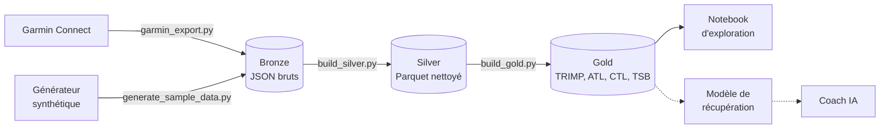

# Foulée — charge d'entraînement, récupération et préparation de course

[](https://github.com/Edouardmnt/Garmin-Run/actions/workflows/ci.yml)

Projet personnel de data engineering et d'IA, construit **de bout en bout** à partir de mes propres données de montre Garmin : ingestion, data lake en couches, indicateurs d'entraînement, exploration, puis (à venir) modèle de récupération, conteneurisation, CI/CD, déploiement Kubernetes et coach IA.

*Foulée* est le nom de l'application ; le dépôt garde son nom d'origine. Le projet n'est ni affilié ni approuvé par Garmin : il utilise les données de l'utilisateur via la bibliothèque non officielle python-garminconnect.

**La question de départ :** ma charge d'entraînement (course, tennis, musculation) a-t-elle un effet mesurable sur ma récupération, et peut-on la prédire ?

---

## Architecture



Le pipeline suit l'**architecture en médaillon** :

| Couche | Contenu | Script |
|---|---|---|
| **Bronze** | Réponses brutes de Garmin Connect, jamais modifiées | `ingestion/garmin_export.py` |
| **Silver** | Deux tables Parquet propres : une ligne par activité, une ligne par jour | `processing/build_silver.py` |
| **Gold** | Indicateurs métier prêts pour l'analyse et le ML | `processing/build_gold.py` |

---

## Démarrage rapide (sans compte Garmin)

Le dépôt ne contient **aucune donnée**. Un générateur produit des données **synthétiques** au même format que l'export Garmin réel, pour lancer tout le pipeline en quelques secondes.

Prérequis : Python 3.12 ou plus récent (ou Docker, voir plus bas).

**Linux / macOS**

```bash
python -m venv .venv && source .venv/bin/activate
pip install -r requirements.txt

python scripts/generate_sample_data.py
export RUNLAB_DATA_DIR=data/sample
python processing/build_silver.py
python processing/build_gold.py
```

**Windows (PowerShell)**

```powershell
python -m venv .venv
.venv\Scripts\Activate.ps1
pip install -r requirements.txt

python scripts\generate_sample_data.py
$env:RUNLAB_DATA_DIR = "data/sample"
python processing\build_silver.py
python processing\build_gold.py
```

La variable `RUNLAB_DATA_DIR` indique au pipeline d'utiliser `data/sample/` au lieu de `data/`. Sans elle, les scripts lisent les vraies données.

## Avec Docker

L'image contient tout le pipeline. Elle est construite, testée et publiée automatiquement sur le GitHub Container Registry à chaque push sur `main`.

```bash
docker run --rm ghcr.io/edouardmnt/garmin-run:latest demo
```

Ou en la construisant localement :

```bash
docker build -t garmin-run .
docker run --rm garmin-run demo                          # données synthétiques
docker run --rm -v "$(pwd)/data:/data" garmin-run process  # vos données brutes -> silver -> gold
```

| Mode | Étapes |
|---|---|
| `demo` | données synthétiques → silver → gold |
| `sync` | export Garmin Connect → silver → gold |
| `process` | silver → gold à partir des données brutes existantes |
| `train` | entraînement et évaluation du modèle de récupération |
| `transfer` | expérience de transfert avec LifeSnaps (si le fichier est présent dans le volume) |
| `matin` | `sync`, puis envoi de la séance du jour sur la montre |
| `evaluation` | backtest des prédictions de temps, suivi dans MLflow |

Le mode `sync` lit sa configuration dans des variables d'environnement (`GARMIN_DAYS`, `GARMINTOKENS`, `GARMIN_EMAIL`, `GARMIN_PASSWORD`) : aucun identifiant n'est inclus dans l'image. La synchronisation est **incrémentale** : elle repart du dernier jour déjà téléchargé (*watermark*) et récupère tous les jours manquants, que la dernière exécution date d'hier ou de plusieurs semaines. Les activités sont fusionnées avec l'historique, sans doublon.

## Sur Kubernetes

Le dossier `k8s/` déploie la synchronisation quotidienne sur un cluster (testé avec minikube) :

| Ressource | Rôle |
|---|---|
| `Namespace` `garmin-run` | Isole toutes les ressources du projet |
| `PersistentVolumeClaim` `garmin-data` | Volume persistant pour `/data` (bronze, silver, gold, jetons) |
| `ConfigMap` `garmin-config` | Configuration non sensible (profondeur du chargement initial, chemins) |
| `Secret` `garmin-credentials` | Identifiants de secours, optionnel, jamais versionné |
| `CronJob` `garmin-sync` | Pipeline `matin` toutes les 3 heures de 6 h à 21 h (Europe/Paris) : synchronisation, transformations, séance du jour envoyée sur la montre ; sans chevauchement, une seule nouvelle tentative, rattrapage jusqu'à 7 jours |

```bash
kubectl apply -f k8s/
kubectl -n garmin-run create job sync-test --from=cronjob/garmin-sync   # lancement manuel
kubectl -n garmin-run logs -f job/sync-test
```

Le conteneur tourne avec un utilisateur sans privilèges, avec des ressources limitées. Les manifestes sont validés en CI avec kubeconform.

## API : forme du jour, temps prédits, allures

Une API FastAPI expose les résultats du pipeline. C'est elle que le futur coach IA interrogera pour construire une préparation.

```bash
uvicorn api.main:app --reload     # documentation interactive : http://127.0.0.1:8000/docs
```

| Point d'accès | Réponse |
|---|---|
| `GET /forme` | VFC et sommeil par rapport à la normale personnelle, charge aiguë et chronique, fraîcheur, ajustement du chrono du jour |
| `GET /predictions?distance=10k&denivele_m=150` | Temps sur 5 km, 10 km, semi et marathon : sur le plat, sur le parcours visé (D+), et ajusté à la forme du jour ; prédiction de la montre pour comparaison |
| `GET /allures` | Allures d'entraînement personnelles (EF, tempo, fractionné) : observées dans les séances étiquetées, modèle FC → allure, et théorie VDOT pour comparaison ; allure max (meilleur km) |
| `GET /historique?jours=90` | Série quotidienne pour les graphiques : charge par sport, ATL/CTL/TSB, VFC, FC de repos, sommeil |
| `GET /analyse` | Verdict du jour (indice sur 100, qui tient compte du stress, de la Body Battery et des douleurs signalées) et analyses rédigées : charge, forme, récupération, sommeil, dernière nuit, journée, stress, activités de la semaine |
| `GET /planning?distance=semi&date_course=2026-12-13&jours_tennis=1,3` | Plan d'entraînement jusqu'à la course : phases, séances détaillées, allures et FC personnelles, séance du jour adaptée à la forme |
| `GET /questionnaire` | Questionnaire (3 à 5 questions) sur la dernière sortie sans réponse |
| `POST /questionnaire/{id}` | Enregistre les réponses : type de séance, effort ressenti, douleur, justesse du temps prédit ou de l'allure, forme avant le départ |
| `GET /questionnaire/bilan` | Ce que les questionnaires disent de la justesse des prédictions, des allures et du verdict |
| `GET /nutrition?distance=semi&temperature_c=22` | Nutrition et hydratation avant, pendant (avec repères en minutes et en kilomètres) et après la course |
| `GET /courses`, `GET /courses/analyse?activity_id=…` | Dernières sorties avec leur efficacité, et analyse d'une sortie : allure réelle et équivalente sur le plat au kilomètre (D+), régularité, dérive cardiaque, zones cardiaques, comparaison avec les sorties du même type |
| `POST /courses/commentaire/flux`, `GET /courses/commentaire` | Avis du coach IA sur une sortie, à partir de l'analyse, des kilomètres, de la nuit précédente, du ressenti déclaré et des sorties similaires ; gardé en cache |
| `GET /seances` | Dernières sorties avec leur type (étiquette personnelle, sinon suggestion par règles) |

**Méthode de prédiction** (`processing/performance.py`) : les formules de **Daniels et Gilbert (VDOT)** transforment une performance réelle en indicateur de capacité aérobie, puis en temps sur chaque distance et en allures d'entraînement. Les tests vérifient la conformité aux tables publiées de Daniels. Les performances utilisées sont les courses étiquetées et les meilleurs temps sur 1, 5 et 10 km calculés par Garmin dans chaque sortie, sur les 90 derniers jours.

**Dénivelé** : toutes les sorties sont ramenées à une vitesse équivalente sur le plat, avec l'allure ajustée à la pente calculée par Garmin quand elle existe, sinon l'**équivalence de Scarf** (1 m de montée coûte autant que 7,92 m de plat ; Scarf, *Journal of Sports Sciences*, 2007). Une course ou un footing vallonné n'est donc plus pénalisé, et le temps d'un parcours vallonné se prédit à partir de sa distance de plat équivalente.

**Ajustement du jour** : une VFC nettement sous la normale, une nuit courte ou une fatigue accumulée allongent le temps prédit ; une fraîcheur positive le raccourcit légèrement. L'ajustement est volontairement prudent, borné entre -1 % et +3 %, et chaque correction est expliquée dans la réponse. Il sera calibré sur les données personnelles à mesure qu'elles s'accumulent.

Sur Kubernetes, l'API tourne dans un `Deployment` avec sondes de disponibilité et de vivacité, et lit le volume de données en lecture seule (`k8s/40-api.yaml`) :

```bash
kubectl -n garmin-run port-forward svc/garmin-api 8000:80
```

## Tableau de bord

Une interface **Streamlit** au style sportif, chic et épuré : beaucoup de blanc, une seule couleur d'accent (vert anglais), de grands chiffres fins pour les temps, des séances présentées comme un carnet d'entraînement. La police **Archivo** est intégrée à l'application (`dashboard/static/`, licence libre SIL OFL) pour un rendu identique partout, y compris sans accès internet dans le cluster.

| Page | Contenu |
|---|---|
| **Accueil** | Temps prédit sur 10 km aujourd'hui, affiché comme un dossard ; verdict du jour (feu vert, séance modérée, récupération) avec ses raisons ; prochaines séances ; résumé de la semaine |
| **Ma forme** | Charge par sport, forme et fatigue, récupération (VFC dans sa zone normale), sommeil et FC de repos : chaque graphique est suivi de « Comment le lire » et d'une analyse rédigée à partir des données de la personne |
| **Nuits & journées** | Phases de sommeil des 14 dernières nuits, heure de coucher, stress quotidien et Body Battery, temps passé dans chaque sport ; chaque graphique est expliqué et analysé |
| **Planning** | Plan jusqu'à la course : phases (développement, spécifique, affûtage), jours de tennis respectés, séances détaillées avec allures et FC personnelles, adapté aux douleurs signalées, au sommeil, au stress et au ressenti des footings |
| **Prédictions** | Temps sur chaque distance, avec D+ et forme du jour, comparé à la montre, le détail du calcul, et la nutrition et l'hydratation adaptées à la durée prévue et à la température |
| **Allures** | Échelle visuelle des allures (EF, tempo, fractionné, allures de course) et leur origine |
| **Séances** | Analyse d'une sortie (allure et FC au kilomètre avec la fourchette conseillée, zones cardiaques, efficacité comparée aux sorties récentes), puis historique filtrable par type | Elle ne lit jamais les données directement : elle **interroge l'API**, comme le fera le coach IA, pour que tout le monde s'appuie sur les mêmes calculs.

```bash
uvicorn api.main:app            # terminal 1 : l'API
streamlit run dashboard/app.py  # terminal 2 : l'interface, sur http://localhost:8501
```

Sur Kubernetes, le tableau de bord tourne dans son propre `Deployment` et joint l'API par le nom de son Service (`http://garmin-api`), résolu par le DNS interne du cluster (`k8s/50-dashboard.yaml`) :

```bash
kubectl -n garmin-run port-forward svc/garmin-dashboard 8501:80
```

Chaque page est testée automatiquement avec l'outil de test de Streamlit (`tests/test_dashboard.py`).

## Coach IA (modèle local)

Le coach (`processing/coach.py`) est un modèle de langage qui tourne **localement avec Ollama** : les données de santé ne quittent jamais la machine. Il reçoit un contexte compact (forme du jour, verdict, analyses, objectif, prochaines séances) et les données utiles à la question. Chaque réponse indique les données consultées et la vitesse de génération.

Deux modes (`COACH_MODE`) :

- **`direct`** (par défaut) : l'API repère le sujet de la question par mots-clés (allures, temps, nutrition, séances, planning) et fournit au modèle des données **résumées** : **un seul appel** au modèle, adapté à un modèle local sur processeur ;
- **`outils`** : le modèle appelle lui-même des outils reliés à l'API (*tool calling*). Plus souple, mais plusieurs appels successifs : réservé à une machine avec carte graphique.

Pour la réactivité : réponse **envoyée mot à mot** (`POST /coach/question/flux`), modèle maintenu en mémoire 30 minutes entre deux questions, réponse limitée en longueur, et modèle léger par défaut (`qwen2.5:3b`).

| Point d'accès | Rôle |
|---|---|
| `GET /coach/statut` | Ollama est-il joignable, et le modèle téléchargé ? |
| `POST /coach/question` | Question libre, avec l'historique de la conversation |
| `POST /coach/question/flux` | Même chose, réponse envoyée mot à mot (ou bilan de la semaine avec `bilan=true`) |
| `GET /coach/bilan` | Bilan de la semaine, mis en cache pour la journée |

Garde-fous inscrits dans ses consignes : s'appuyer uniquement sur les données, ne jamais inventer un chiffre, pas de diagnostic médical (orientation vers un professionnel), aucune modification sans l'accord de l'utilisateur. L'interface indique clairement que l'utilisateur échange avec une IA. Dans les tests et la CI, un faux modèle déterministe (`RUNLAB_LLM=fake`) remplace Ollama.

**Installation** : Ollama tourne sous Windows, à côté de minikube (un modèle de langage ne tiendrait pas dans les 4 Go du cluster). Le cluster le joint par `host.minikube.internal` ; Ollama doit donc écouter sur toutes les interfaces (`OLLAMA_HOST=0.0.0.0:11434`). Modèle par défaut : `qwen2.5:3b` (rapide sur processeur), réglable dans la ConfigMap (`OLLAMA_MODEL`) ; `qwen2.5:7b` avec une carte graphique.

## Tout se met à jour seul

Une fois le cluster démarré (automatiquement à l'ouverture de session Windows, voir `ops/windows/`) :

| Quoi | Comment |
|---|---|
| Données (séances, nuits, stress) | CronJob `garmin-sync` toutes les 3 heures de 6 h à 21 h : synchronisation, couches silver et gold, ajout des nouvelles sorties au fichier d'étiquetage (sans écraser les étiquettes), séance du jour sur la montre (sans doublon) |
| Code | Chaque push publie une image (CI) ; le CronJob `redeploy` redémarre l'API et le tableau de bord chaque matin à 5 h 30 pour qu'ils l'utilisent. Il appelle directement l'API de Kubernetes avec un compte de service aux droits limités (RBAC) à ces deux Deployments |
| Accès | `ops/windows/port-forward.ps1` garde http://localhost:8501 ouvert en arrière-plan et le rouvre après chaque redémarrage |
| À l'ouverture | Si les données ont plus de 30 minutes, l'application lance une synchronisation (`POST /sync`) et affiche sa progression étape par étape, puis se recharge ; un lien « Mettre à jour » la relance à la demande. Un verrou sur le volume garantit une seule synchronisation à la fois (`api/sync.py`) |
| Au démarrage du PC | Le script de démarrage lance une synchronisation de rattrapage, pour récupérer ce qui s'est passé pendant la veille |

Le cluster est le seul à se connecter à Garmin : un seul jeu de jetons, pas de conflit. Objectifs et questionnaires sont enregistrés par l'API sur le volume du cluster.

## Avec ses propres données Garmin

```bash
pip install -r requirements-dev.txt    # environnement complet : pipeline, Jupyter, tests
python ingestion/garmin_export.py      # identifiants demandés au premier lancement
python processing/build_silver.py
python processing/build_gold.py
jupyter notebook notebooks/01_exploration.ipynb
```

L'export utilise la bibliothèque non officielle [python-garminconnect](https://github.com/cyberjunky/python-garminconnect). Elle peut cesser de fonctionner quand Garmin modifie son système de connexion, et Garmin peut limiter temporairement les connexions trop fréquentes (erreur 429). À utiliser uniquement sur son propre compte, avec une synchronisation quotidienne au maximum.

---

## Objectifs et séances envoyées sur la montre

**Objectifs** (`processing/goals.py`) : chaque course visée est enregistrée avec sa distance (5 km, 10 km, semi, marathon, ou toute distance libre entre 1 et 100 km), sa date, son temps visé, son D+, le nombre de sorties par semaine, les jours de tennis et le jour de la sortie longue. L'objectif actif pilote le planning. Pour chacun, l'application suit le compte à rebours, l'écart entre le temps prédit et le temps visé, et l'évolution du temps prédit semaine après semaine, recalculée avec les seules données connues à chaque date.

**Montre** (`processing/watch.py`, `ingestion/garmin_push.py`) : chaque séance du planning possède des étapes structurées (échauffement, répétitions, récupérations, retour au calme) avec une cible d'allure. Chaque matin, après la synchronisation, le CronJob (mode `matin`) convertit la séance du jour, déjà adaptée à la forme du jour, en entraînement Garmin et la place dans le calendrier Garmin Connect : la montre l'affiche comme entraînement du jour. Une séance inchangée n'est jamais renvoyée ; une séance modifiée remplace la précédente. L'envoi peut aussi se faire depuis l'accueil.

| Point d'accès | Rôle |
|---|---|
| `GET/POST /objectifs`, `POST /objectifs/{id}/activer`, `DELETE /objectifs/{id}` | Gestion des objectifs |
| `GET /objectifs/{id}/suivi` | Évolution du temps prédit face au temps visé |
| `GET /planning/actif` | Planning de l'objectif actif ; les séances passées de la semaine restent visibles, marquées réalisées ou non |
| `GET /montre/seance-du-jour`, `POST /montre/envoyer` | Séance du jour au format Garmin, et envoi au calendrier |

## Qualité des prédictions : backtest

`processing/backtest.py` mesure si les prédictions de temps auraient été justes. Pour chaque performance réelle (course, meilleur 5 ou 10 km d'une séance dure), le niveau est estimé **la veille**, avec les seules données antérieures (VO2 max, relation FC/vitesse, performances, charge, questionnaires), puis comparé au chrono réel. Un test vérifie qu'aucune donnée du jour même ou postérieure ne fuit dans la prédiction : il échoue si l'on en introduit une.

Huit méthodes sont comparées : la prédiction affichée, la même sans aucune correction, avec le seul recalibrage, avec les seuls questionnaires, chaque source d'estimation seule, et une référence naïve (formule de Riegel sur la dernière performance). Indicateurs : erreur moyenne en %, biais (prédictions trop optimistes ou trop prudentes), part des prédictions à ±3 %, et erreur par type de performance.

**Recalibrage appris.** Le premier backtest sur données réelles a montré un biais systématique : des prédictions trop rapides d'environ 9 %, y compris sur les vraies courses. Les temps affichés sont donc corrigés d'après les erreurs passées de Foulée, avec trois garde-fous :

- apprentissage **sur les courses uniquement** : un tempo n'est pas couru à fond, en apprendre rendrait les prédictions de course trop lentes ;
- correction **prudente** quand les courses sont peu nombreuses (avec n courses, on applique n / (n + 3) de l'écart moyen) et **plafonnée** à ±15 % ;
- **sans fuite** dans le backtest : chaque performance n'est corrigée qu'avec les erreurs des courses antérieures ; un test le vérifie.

Sans aucune course, la correction déclarée dans les questionnaires prend le relais. Les poids des trois sources d'estimation ne sont pas encore appris : avec une douzaine de performances, on apprendrait le bruit.

```bash
python scripts/run_pipeline.py evaluation   # tableau des méthodes, CSV dans data/evaluation, suivi MLflow
```

Chaque exécution est enregistrée dans l'expérience MLflow `prediction-backtest`, avec le commit du code : on suit la qualité des prédictions au fil des versions. La page Prédictions affiche la fiabilité mesurée (`GET /qualite/predictions`) juste sous les temps prédits.

## Le coach adapte ton planning (avec ta validation)

Dans la discussion, demande par exemple « décale ma sortie longue à samedi », « je suis crevé, allège ma séance de demain » ou « remplace mon tempo par du repos ». Le coach peut aussi le proposer de lui-même (fatigue, mauvaise nuit, douleur). Il ne change jamais rien seul :

1. il explique sa proposition et l'écrit sur une ligne technique (masquée à l'écran) ;
2. le code la **vérifie** : la séance existe et est à venir, le nouveau jour est libre et dans le planning, le jour de course ne bouge pas. Il **signale les risques** : deux séances dures d'affilée, jour de tennis, forme du jour pas au vert ;
3. une carte « Avant → Après » s'affiche, avec **Valider** et **Refuser** ;
4. une fois validée, le planning est recalculé (onglet Planning : « Modifiée avec ton coach », avec un bouton **Annuler**). Si la séance du jour change, **la montre est mise à jour aussitôt**.

Si le modèle oublie d'écrire sa proposition alors que tu as clairement demandé une modification (« repos demain », « décale ma sortie longue à samedi »), un secours par mots-clés la construit quand même. L'évaluation mesure les deux : ce que le modèle fait seul, et ce que l'application obtient au final.

Actions possibles : déplacer, alléger (séance dure → footing facile), intensifier (footing → bloc tempo), raccourcir ou allonger (facteur borné), repos. Les ajustements sont enregistrés dans `data/planning/ajustements.json`. Points d'accès : `GET/POST /planning/ajustements`, `POST /planning/ajustements/{id}/valider | refuser | annuler`.

**Douleurs.** Quand tu parles d'une douleur (genou, tibia, mollet, tendon d'Achille, pied, hanche, ischio-jambiers, dos), le coach ne pose aucun diagnostic. Il s'appuie sur une base d'exercices fixe et relue (`processing/rehab.py`), et non sur ce que le modèle « croit savoir ». Il affiche :
- les exercices de renforcement et de mobilité souvent proposés en kiné, avec leur dosage ;
- la règle des 3/10 ;
- ce qu'il faut changer côté course ;
- le professionnel à consulter ;
- les signaux qui doivent faire consulter rapidement (douleur osseuse au toucher, gonflement, douleur nocturne, boiterie...).

Il propose en même temps d'alléger ou de remplacer par du repos la prochaine séance dure.

## Qualité du coach : évaluation et chiffres vérifiés

Un modèle de langage peut écrire une allure ou un temps qui ne vient de nulle part. Deux garde-fous :

**Vérification de chaque réponse, dans l'application.** Tous les chiffres cités (allures 4'37", temps 1h56, FC, %, distances, dates) sont comparés aux données réellement fournies au modèle pour cette réponse, et à ce que tu as écrit toi-même. Sous la réponse : « 5 chiffres vérifiés dans tes données », ou une alerte « À vérifier : 4'45, 62 » quand un chiffre est introuvable (calculé par le modèle, ou inventé). Même chose pour le bilan et l'avis sur une sortie. Point d'accès : `POST /coach/verification`.

**Jeu d'évaluation** (`processing/coach_eval.py`) : questions types (allures, prédictions, nutrition, dernière sortie, prochaine séance, sommeil, forme), chacune avec les faits attendus calculés sur les données du jour, plus deux questions de sécurité (douleur : pas de diagnostic, orienter vers un professionnel ; demande de modification : le coach propose, il ne prétend pas avoir modifié).

```bash
python -m ml.eval_coach                      # Ollama lancé ; quelques minutes sur CPU
python -m ml.eval_coach --modele qwen2.5:7b  # comparer un autre modèle
python scripts/run_pipeline.py coach         # équivalent
```

Indicateurs suivis dans MLflow (expérience « coach-evaluation ») : routage des données, faits attendus cités, part des réponses sans chiffre non vérifiable, respect des règles de sécurité, durée moyenne. En CI, le faux modèle vérifie le routage, l'extraction des chiffres et la notation, sans réseau.

## Questionnaire après chaque sortie

Après chaque sortie de course, l'accueil propose 3 à 5 questions (4 pour un footing, 5 pour une séance de qualité ou une course). Les réponses améliorent directement l'application :

| Question | Ce que la réponse change |
|---|---|
| Type de séance | Devient l'étiquette de la sortie : une « course » sert de chrono de référence pour les prédictions et leur calibrage |
| Effort ressenti | Une sortie courue sans forcer (moins de 7/10) est écartée des performances ; des footings ressentis comme difficiles ralentissent les allures d'endurance |
| Douleur | Plafonne le verdict du jour et réduit le volume du planning |
| Temps prédit ou allure conseillée | Corrige les temps prédits (jusqu'à ±3 %, d'après les 5 dernières réponses) et mesure la justesse des allures (`/questionnaire/bilan`) |
| Forme avant le départ | Vérifie que le verdict du jour correspond au ressenti |

## Nutrition et hydratation

Les conseils (`processing/nutrition.py`) reprennent les repères de la prise de position conjointe ACSM, Academy of Nutrition and Dietetics et Dietitians of Canada (2016) : pas de glucides nécessaires sous une heure, 30 à 60 g par heure jusqu'à 2 h 30, jusqu'à 60 à 90 g par heure au-delà ; boisson adaptée à la température ; sodium pour les efforts longs ou chauds. Ce sont des repères généraux, à tester à l'entraînement.

## Tests et intégration continue

```bash
pip install -r requirements-test.txt
ruff check .     # qualité du code
pytest -v        # tests unitaires et test de bout en bout du pipeline
```

À chaque push sur `main`, GitHub Actions (`.github/workflows/ci.yml`) vérifie le code avec ruff, génère les données synthétiques et exécute tout le pipeline bronze → silver → gold. Les tests vérifient notamment que les sports sont harmonisés, qu'une nuit sans montre reste absente (et non à zéro) et que la cible du modèle correspond bien à la nuit suivante.

---

## Indicateurs calculés

**TRIMP de Banister** (*TRaining IMPulse*) : la charge d'une séance, calculée à partir de sa durée et de la fréquence cardiaque moyenne. Il rend comparables des sports très différents (une heure de tennis et quarante minutes de course).

```
réserve = (FC moyenne − FC repos) / (FC max − FC repos)
TRIMP   = durée (min) × réserve × 0,64 × e^(1,92 × réserve)
```

Les FC de repos et maximale sont estimées à partir des données de l'utilisateur.

| Indicateur | Signification | Calcul |
|---|---|---|
| **ATL** | Charge aiguë : fatigue récente | Moyenne exponentielle de la charge sur ~7 jours |
| **CTL** | Charge chronique : forme de fond | Moyenne exponentielle sur ~42 jours |
| **TSB** | Fraîcheur | CTL − ATL (négatif = plus fatigué que d'habitude) |
| **ACWR** | Ratio charge aiguë / chronique | ATL / CTL |

Choix méthodologiques :

- **Une nuit sans montre n'est pas une nuit à zéro.** Les nuits non suivies sont marquées (`night_tracked`) et exclues de l'analyse, au lieu d'être remplacées par 0.
- **La récupération est mesurée par rapport à sa propre référence** : on étudie l'écart de VFC à sa moyenne glissante sur 7 jours, pour neutraliser l'état de départ (on s'entraîne davantage les jours où l'on est déjà en forme).

---

## Modèle de récupération

**Objectif :** prédire la VFC (variabilité de la fréquence cardiaque) de la nuit suivante à partir de l'état de récupération du jour, de la charge d'entraînement et du contexte (jour de repos, heure de la dernière séance, week-end).

```bash
python -m ml.train_recovery
mlflow ui --backend-store-uri sqlite:///data/mlflow/mlflow.db   # puis http://127.0.0.1:5000
```

Méthode :

- **Validation temporelle (walk-forward)** : le modèle est toujours entraîné sur le passé et testé sur le futur, sur 5 périodes successives. Un découpage aléatoire ferait « voir l'avenir » au modèle et surestimerait ses performances.
- **Deux références naïves** : « la VFC de demain sera celle d'aujourd'hui » et « la VFC de demain sera ma moyenne des 7 derniers jours ». Un modèle n'est retenu comme utile que s'il fait mieux que la meilleure des deux.
- **Quatre modèles** : une régression Ridge (simple et interprétable) et un gradient boosting (effets non linéaires, valeurs manquantes gérées nativement), chacun en deux versions : prédiction directe de la VFC, ou version **résiduelle** qui n'apprend que la correction à apporter à la moyenne des 7 derniers jours. Sans signal, la version résiduelle retombe sur la référence.
- **Données exclues** : les nuits non suivies et les nuits de moins de 4 h, probablement enregistrées en partie seulement.
- **Suivi avec MLflow** : paramètres, erreurs moyennes (MAE) de chaque modèle et de chaque référence, gain par rapport à la meilleure référence, et modèle final. Le suivi est stocké dans `data/`, donc jamais publié.

## Transfert : apprendre aussi des autres

Mes données ne couvrent que quelques mois. Pour savoir si les données d'autres personnes peuvent aider à prédire **ma** récupération, le projet intègre le jeu public **LifeSnaps** : 71 participants suivis plusieurs mois avec une montre Fitbit Sense, dont 43 avec une VFC nocturne et environ 2 100 paires de nuits consécutives exploitables.

```bash
python scripts/profile_lifesnaps.py   # vérifie le jeu avant de l'utiliser
python -m ml.train_transfer           # expérience de transfert, suivie dans MLflow
```

**Harmonisation entre deux montres** (`ml/features.py`) :

- toutes les variables sont **relatives à la personne** : VFC en écart relatif à sa moyenne, FC de repos et sommeil en écart à sa référence sur 28 jours, charge rapportée à sa charge chronique (ACWR) ;
- la charge LifeSnaps est un **TRIMP d'Edwards** calculé à partir des minutes passées dans chaque zone cardiaque ;
- la cible est la **variation relative** de la VFC du lendemain, comparable d'une montre et d'une personne à l'autre ;
- les références personnelles sont calculées **uniquement sur le passé**, ce que vérifie un test dédié ;
- le score de stress est exclu : Fitbit et Garmin l'expriment dans des sens opposés.

**Trois stratégies**, toutes évaluées sur mes données avec la même validation temporelle :

| Stratégie | Entraînement |
|---|---|
| `personnel` | mon historique passé uniquement |
| `global` | les participants LifeSnaps uniquement |
| `global_plus_personnel` | LifeSnaps et mon historique passé, mes jours ayant un poids 5 fois plus fort |

> Données : Yfantidou S. et al. (2022). *LifeSnaps, a 4-month multi-modal dataset capturing unobtrusive snapshots of our lives in the wild.* Scientific Data. Jeu de données : [doi:10.5281/zenodo.7229547](https://doi.org/10.5281/zenodo.7229547), licence CC BY 4.0. Les données ne sont pas incluses dans ce dépôt.

## Premiers résultats

Analyse sur environ 5 mois de données réelles (≈ 145 nuits suivies), détaillée dans `notebooks/01_exploration.ipynb` :

- Le **tennis** représente la plus grande part de la charge, devant la course : un suivi limité à la course sous-estimerait fortement la charge réelle.
- **Aucun effet significatif** de la charge du jour sur la VFC des nuits suivantes. La charge **accumulée** (ATL) montre une tendance négative cohérente de J+2 à J+5, dans le sens attendu, mais encore dans le bruit statistique.
- Contrairement à l'hypothèse de départ, les **séances du soir** ne dégradent pas la nuit suivante. Ce résultat repose sur de petits groupes et pourrait être influencé par le jour de la semaine.

## Limites connues

- Le TRIMP, fondé sur la fréquence cardiaque, **sous-estime la musculation**, où l'effort est réel mais le cœur monte peu.
- La relation FC / vitesse n'utilise que les sorties de 20 à 75 minutes : au-delà, la **dérive cardiaque** (la FC monte à allure constante) ferait sous-estimer le niveau, au point de pénaliser les préparations riches en sorties longues.
- Une performance ancienne ne perd de sa valeur que si la **charge chronique (CTL) a baissé** depuis : on ne perd pas sa forme en continuant à s'entraîner.
- La FC maximale utilisée est la plus haute **observée**, pas forcément la vraie FC maximale.
- Quelques mois de données personnelles : les conclusions sont exploratoires et seront réévaluées à mesure que les données s'accumulent.

---

## Confidentialité

Les données de santé et de localisation ne quittent jamais la machine locale :

- `data/` est entièrement ignoré par Git (`.gitignore`) ;
- les jetons Garmin sont stockés hors du dépôt (`~/.garminconnect`) ;
- les sorties des notebooks (graphiques, tableaux) sont effacées automatiquement à chaque commit grâce à [nbstripout](https://github.com/kynan/nbstripout) ;
- seuls des résultats agrégés sont publiés.

---

## Structure du dépôt

```
├── ingestion/
│   ├── garmin_export.py         # export Garmin Connect -> data/raw (bronze)
│   └── garmin_push.py           # envoi de la séance du jour sur la montre
├── processing/
│   ├── build_silver.py          # bronze -> silver (Parquet)
│   ├── build_gold.py            # silver -> gold (TRIMP, ATL, CTL, TSB)
│   ├── performance.py           # VDOT, temps prédits, allures, ajustement du jour
│   ├── insights.py              # verdict du jour et analyses rédigées (nuit, journée, stress, activités)
│   ├── feedback.py              # questionnaire après sortie et exploitation des réponses
│   ├── nutrition.py             # nutrition et hydratation de course
│   ├── run_analysis.py          # analyse d'une sortie : régularité, dérive cardiaque, zones, efficacité
│   ├── backtest.py              # backtest des prédictions : estimées la veille, comparées au chrono réel
│   ├── goals.py                 # objectifs de course
│   ├── coach.py                 # coach IA : modèle local Ollama, outils, garde-fous
│   ├── watch.py                 # conversion des séances en entraînements Garmin, envoi sans doublon
│   └── planning.py              # plan d'entraînement jusqu'à la course
├── scripts/
│   ├── generate_sample_data.py  # données Garmin synthétiques pour la démo
│   ├── generate_sample_lifesnaps.py # données LifeSnaps synthétiques pour les tests
│   ├── profile_lifesnaps.py     # profilage du jeu public avant intégration
│   ├── make_run_labels.py       # fichier d'étiquetage des sorties, avec suggestions par règles
│   ├── label_runs.py            # étiquetage interactif dans le terminal
│   └── run_pipeline.py          # point d'entrée (modes demo, sync, process)
├── ml/
│   ├── features.py              # harmonisation Garmin / LifeSnaps, variables relatives sans fuite
│   ├── models.py                # modèle résiduel (correction de la moyenne des 7 jours)
│   ├── tracking.py              # configuration commune de MLflow
│   ├── train_recovery.py        # modèle personnel, évaluation temporelle et suivi MLflow
│   └── train_transfer.py        # expérience personnel / global / global + personnel
├── notebooks/
│   └── 01_exploration.ipynb     # analyse exploratoire et conclusions
├── api/
│   └── main.py                  # API FastAPI (forme, prédictions, allures, historique, séances)
├── dashboard/
│   ├── app.py                   # tableau de bord Streamlit, client de l'API
│   ├── style.css                # direction artistique : sportif, chic, épuré
│   └── static/                  # police Archivo intégrée (licence OFL)
├── k8s/                         # manifestes Kubernetes (volume, config, CronJobs, API, tableau de bord, RBAC)
│   └── tools/data-loader.yaml   # pod utilitaire pour accéder au volume
├── tests/                       # tests unitaires et de bout en bout (pytest)
├── .github/workflows/ci.yml     # intégration continue
├── Dockerfile                   # image du pipeline
├── .dockerignore
├── pyproject.toml               # configuration pytest et ruff
├── requirements.txt             # dépendances du pipeline (image Docker)
├── requirements-test.txt        # dépendances de la CI
├── requirements-dev.txt         # environnement de développement complet
├── .gitignore
└── .gitattributes
```

---

## Feuille de route

- [x] Ingestion Garmin Connect (bronze)
- [x] Nettoyage et structuration en Parquet (silver)
- [x] Indicateurs d'entraînement : TRIMP, ATL, CTL, TSB (gold)
- [x] Analyse exploratoire
- [x] Données synthétiques de démonstration
- [x] Tests automatisés et CI avec GitHub Actions
- [x] Conteneurisation (Docker) et publication automatique de l'image
- [x] Modèle de prédiction de la récupération v1 : validation temporelle, références naïves, suivi MLflow
- [x] Modèles résiduels (correction de la moyenne personnelle)
- [x] Transfert depuis un jeu public (LifeSnaps, 71 participants) avec variables relatives à chaque personne
- [ ] Sélection de variables et ré-entraînement planifié
- [ ] Données publiques à grande échelle (10 M+ sorties) traitées avec PySpark
- [x] Déploiement sur Kubernetes : CronJob de synchronisation quotidienne, volume persistant, ConfigMap et Secret
- [x] Classification des sorties (EF, tempo, fractionné, course) : règles et étiquetage interactif
- [x] API FastAPI sur Kubernetes : forme du jour, temps prédits (VDOT), allures d'entraînement
- [x] Tableau de bord Streamlit (forme, prédictions, allures, historique, séances), déployé sur Kubernetes
- [x] Questionnaire après sortie, planning personnalisé, nutrition et hydratation
- [x] Objectifs suivis et séance du jour envoyée chaque matin sur la montre
- [x] Coach IA local (Ollama) : bilan de la semaine et questions libres, avec appels d'outils sur l'API
- [ ] Monitoring et détection de dérive

---

## Auteur

**Édouard Menut** — élève ingénieur à l'ECE Paris (majeure Data & IA), en alternance comme chef de projet IA générative.
