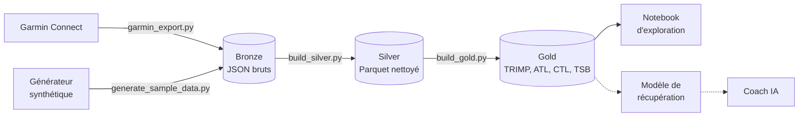

# Garmin-Run — charge d'entraînement et récupération multisport

Projet personnel de data engineering et d'IA, construit **de bout en bout** à partir de mes propres données de montre Garmin : ingestion, data lake en couches, indicateurs d'entraînement, exploration, puis (à venir) modèle de récupération, conteneurisation, CI/CD, déploiement Kubernetes et coach IA.

**La question de départ :** ma charge d'entraînement (course, tennis, musculation) a-t-elle un effet mesurable sur ma récupération, et peut-on la prédire ?

---

## Architecture



Le pipeline suit l'**architecture en médaillon** :

| Couche | Contenu | Script |
|---|---|---|
| **Bronze** | Réponses brutes de Garmin Connect, jamais modifiées | `ingestion/garmin_export.py` |
| **Silver** | Deux tables Parquet propres : une ligne par activité, une ligne par jour | `processing/build_silver.py` |
| **Gold** | Indicateurs métier prêts pour l'analyse et le ML | `processing/build_gold.py` |

---

## Démarrage rapide (sans compte Garmin)

Le dépôt ne contient **aucune donnée**. Un générateur produit des données **synthétiques** au même format que l'export Garmin réel, pour lancer tout le pipeline en quelques secondes.

Prérequis : Python 3.12 ou plus récent.

**Linux / macOS**

```bash
python -m venv .venv && source .venv/bin/activate
pip install -r requirements.txt

python scripts/generate_sample_data.py
export RUNLAB_DATA_DIR=data/sample
python processing/build_silver.py
python processing/build_gold.py
```

**Windows (PowerShell)**

```powershell
python -m venv .venv
.venv\Scripts\Activate.ps1
pip install -r requirements.txt

python scripts\generate_sample_data.py
$env:RUNLAB_DATA_DIR = "data/sample"
python processing\build_silver.py
python processing\build_gold.py
```

La variable `RUNLAB_DATA_DIR` indique au pipeline d'utiliser `data/sample/` au lieu de `data/`. Sans elle, les scripts lisent les vraies données.

## Avec ses propres données Garmin

```bash
python ingestion/garmin_export.py      # identifiants demandés au premier lancement
python processing/build_silver.py
python processing/build_gold.py
jupyter notebook notebooks/01_exploration.ipynb
```

L'export utilise la bibliothèque non officielle [python-garminconnect](https://github.com/cyberjunky/python-garminconnect). Elle peut cesser de fonctionner quand Garmin modifie son système de connexion, et Garmin peut limiter temporairement les connexions trop fréquentes (erreur 429). À utiliser uniquement sur son propre compte, avec une synchronisation quotidienne au maximum.

---

## Indicateurs calculés

**TRIMP de Banister** (*TRaining IMPulse*) : la charge d'une séance, calculée à partir de sa durée et de la fréquence cardiaque moyenne. Il rend comparables des sports très différents (une heure de tennis et quarante minutes de course).

```
réserve = (FC moyenne − FC repos) / (FC max − FC repos)
TRIMP   = durée (min) × réserve × 0,64 × e^(1,92 × réserve)
```

Les FC de repos et maximale sont estimées à partir des données de l'utilisateur.

| Indicateur | Signification | Calcul |
|---|---|---|
| **ATL** | Charge aiguë : fatigue récente | Moyenne exponentielle de la charge sur ~7 jours |
| **CTL** | Charge chronique : forme de fond | Moyenne exponentielle sur ~42 jours |
| **TSB** | Fraîcheur | CTL − ATL (négatif = plus fatigué que d'habitude) |
| **ACWR** | Ratio charge aiguë / chronique | ATL / CTL |

Choix méthodologiques :

- **Une nuit sans montre n'est pas une nuit à zéro.** Les nuits non suivies sont marquées (`night_tracked`) et exclues de l'analyse, au lieu d'être remplacées par 0.
- **La récupération est mesurée par rapport à sa propre référence** : on étudie l'écart de VFC à sa moyenne glissante sur 7 jours, pour neutraliser l'état de départ (on s'entraîne davantage les jours où l'on est déjà en forme).

---

## Premiers résultats

Analyse sur environ 5 mois de données réelles (≈ 145 nuits suivies), détaillée dans `notebooks/01_exploration.ipynb` :

- Le **tennis** représente la plus grande part de la charge, devant la course : un suivi limité à la course sous-estimerait fortement la charge réelle.
- **Aucun effet significatif** de la charge du jour sur la VFC des nuits suivantes. La charge **accumulée** (ATL) montre une tendance négative cohérente de J+2 à J+5, dans le sens attendu, mais encore dans le bruit statistique.
- Contrairement à l'hypothèse de départ, les **séances du soir** ne dégradent pas la nuit suivante. Ce résultat repose sur de petits groupes et pourrait être influencé par le jour de la semaine.

## Limites connues

- Le TRIMP, fondé sur la fréquence cardiaque, **sous-estime la musculation**, où l'effort est réel mais le cœur monte peu.
- La FC maximale utilisée est la plus haute **observée**, pas forcément la vraie FC maximale.
- Quelques mois de données personnelles : les conclusions sont exploratoires et seront réévaluées à mesure que les données s'accumulent.

---

## Confidentialité

Les données de santé et de localisation ne quittent jamais la machine locale :

- `data/` est entièrement ignoré par Git (`.gitignore`) ;
- les jetons Garmin sont stockés hors du dépôt (`~/.garminconnect`) ;
- les sorties des notebooks (graphiques, tableaux) sont effacées automatiquement à chaque commit grâce à [nbstripout](https://github.com/kynan/nbstripout) ;
- seuls des résultats agrégés sont publiés.

---

## Structure du dépôt

```
├── ingestion/
│   └── garmin_export.py         # export Garmin Connect -> data/raw (bronze)
├── processing/
│   ├── build_silver.py          # bronze -> silver (Parquet)
│   └── build_gold.py            # silver -> gold (TRIMP, ATL, CTL, TSB)
├── scripts/
│   └── generate_sample_data.py  # données synthétiques pour la démo
├── notebooks/
│   └── 01_exploration.ipynb     # analyse exploratoire et conclusions
├── requirements.txt
├── .gitignore
└── .gitattributes
```

---

## Feuille de route

- [x] Ingestion Garmin Connect (bronze)
- [x] Nettoyage et structuration en Parquet (silver)
- [x] Indicateurs d'entraînement : TRIMP, ATL, CTL, TSB (gold)
- [x] Analyse exploratoire
- [x] Données synthétiques de démonstration
- [ ] Tests automatisés et CI avec GitHub Actions
- [ ] Conteneurisation (Docker)
- [ ] Modèle de prédiction de la récupération, comparé à une référence naïve, suivi avec MLflow
- [ ] Données publiques à grande échelle (10 M+ sorties) traitées avec PySpark
- [ ] Déploiement sur Kubernetes : CronJob de synchronisation quotidienne, API FastAPI, tableau de bord
- [ ] Coach IA hebdomadaire basé sur un LLM
- [ ] Monitoring et détection de dérive

---

## Auteur

**Édouard Menut** — élève ingénieur à l'ECE Paris (majeure Data & IA), en alternance comme chef de projet IA générative.
